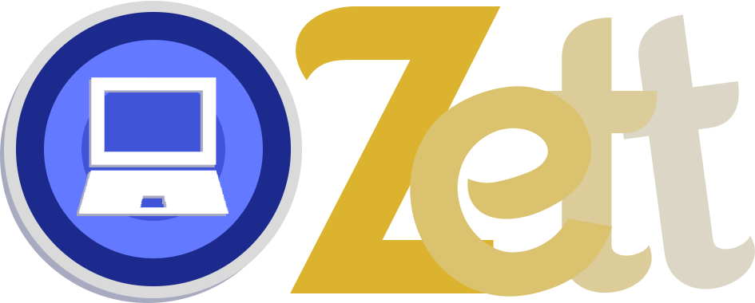

# Projeto portfolio.

> Projeto realizado para mostrar um pouco sobre meus conhecimentos no desenvolvimento de uma página.

O projeto tem como intuito de servir de base para compartilhar meus projetos e aplicativos realizados.

# Informações sobre o projeto:

> **React**: Utilizei a biblioteca do **Next.js** para criar a estrutura com os ativos e componentes do projeto.

> **Tailwind**: Framework usado para estilizar e criar responsividade na página de forma eficiente e prática.

> **TypeScript**: Através de suas diversas ferramentas, ampliei o **JS** e criei uma estrutura sólida e consistente que agrega o projeto de forma evoluída.

> **Firebase**: Usei o banco de dados do Firebase, que permite o manuseio dessa ferramenta de forma gratuita, para realizar a comunicação com o componente de comentários, permitindo o envio e recebimento dos dados sempre que a página atualizar.

**OBS**: A versão gratuita do Firebase possui limitações, devendo ser utilizada apenas para pequenas funções.

# Historio de atualizações:

* 4.3.3
    * 📝 Update px-8 -> px-6.
* 4.3.2
    * 📝 Update project design.
* 4.3.1
    * 📝 Update project design.
* 4.3.0
    * 📦️ New lib(Swiper).
    * 📝 Update project design.
* 4.2.4
    * 📝 Update project design.
* 4.2.3
    * 📝 Add new project.
* 4.2.2
    * 📝 CardComment.
* 4.2.1
    * 📝 'curriculo' file.
* 4.2.0
    * 📝 update pages.
* 4.1.4
    * 🩹 details projets.
* 4.1.3
    * 🩹 details about me(2x).
* 4.1.2
    * 🩹 details about me.
* 4.1.1
    * 📝 new projeto and new skill(Laravel).
* 4.1.0
    * ✨ new library.
* 4.0.4
    * 🩹 package.json package 4x.
* 4.0.3
    * 🩹 package.json package 3x.
* 4.0.2
    * 🩹 package.json package 2x.
* 4.0.2
    * 🩹 package.json package.
* 4.0.1
    * ✨ create animation.
* 4.0.0
    * 📝 new page version.
* 3.0.0
    * ✨ Att ReadMe.
* 2.0.6
    * 📝 Finish pages fixed.
* 2.0.5
    * 🩹 Fixed coding and bug response.
* 2.0.4
    * 🩹 Fix page AboutMe v3.
* 2.0.3
    * 🩹 Fix page AboutMe v2.
* 2.0.2
    * 🩹 Fix page AboutMe.
* 2.0.1
    * ✨ README PAGE UPDATE and fixed bugs.
* 2.0.0
    * ✨ Fixed finish v2.0.
* 1.0.7
    * 🩹 Fixed Api youtube deploy v1.3.
* 1.0.6
    * 🩹 Fixed page deploy v1.2.
* 1.0.5
    * 🩹 Fixed page deploy v1.1.
* 1.0.4
    * 🩹 Fixed root page.
* 1.0.3
    * ✨ Page deploy v1.0.
* 1.0.2
    * 🩹 Fixed empty comment and pageDown.
* 1.0.1
    * 🎉 Alpha version v1.0.
* 1.0.0
    * 🎉 First version finish.
* 0.3.1
    * 🩹 Desktop page finish. Starting the video page.
* 0.3.0
    * ✨ finish desktop page.
* 0.2.2
    * 🎉 desktop display in progress.
* 0.2.1
    * 📝 update pages: Index and aboutme.
* 0.2.1
    * 🩹 Fix bugs.
* 0.2.0
    * ✨ Page mobile finish.
* 0.1.0
    * 📝 Pages skills and projects finish.
* 0.1.0
    * 📝 Pages skills and projects finish.
* 0.0.3
    * ✨ Skills page - 90%.
* 0.0.2
    * ✨ Creating page AboutMe.
* 0.0.1
    * ✨ Div dark, toggle buttons. beyound the profile.
* 0.0.0
    * 🎉 first commit.

Créditos: "Agradeço a Kaique pela dica de atualização do ReadMe e Edvaldo pelo apoio."

Euzebio Batista [@Linkedin](https://www.linkedin.com/in/euzebio-batista) - euzebio.batista2@gmail.com

Criado por **Euzebio Batista**.
**Todos os direitos reservados.**